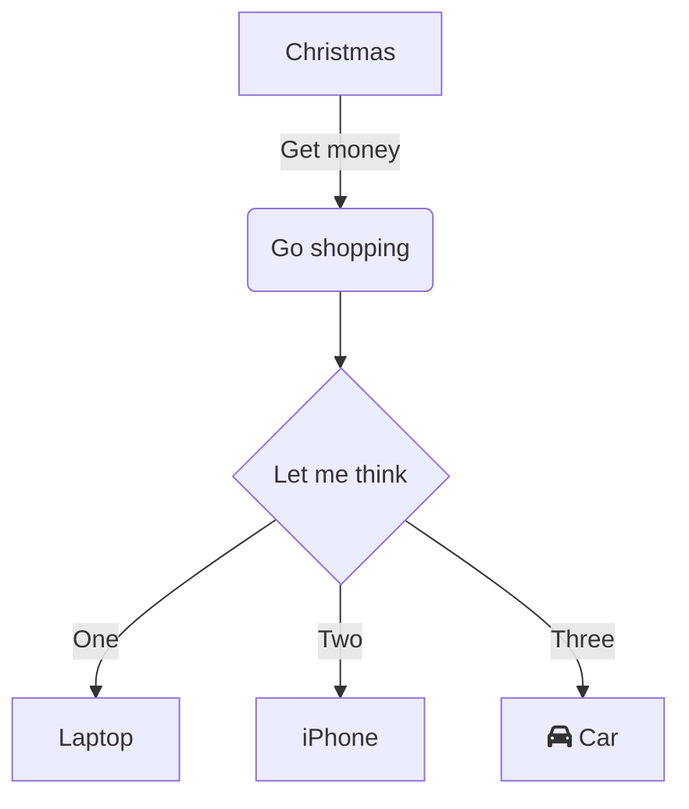

# 1. Record architecture decisions

Date: 2024-11-06

## Status

Accepted

## Context

We need to record the architectural decisions made on this project.

## Decision

We will use Architecture Decision Records, as [described by Michael Nygard](http://thinkrelevance.com/blog/2011/11/15/documenting-architecture-decisions).

## Consequences

See Michael Nygard's article, linked above. For a lightweight ADR toolset, see Nat Pryce's [adr-tools](https://github.com/npryce/adr-tools).
